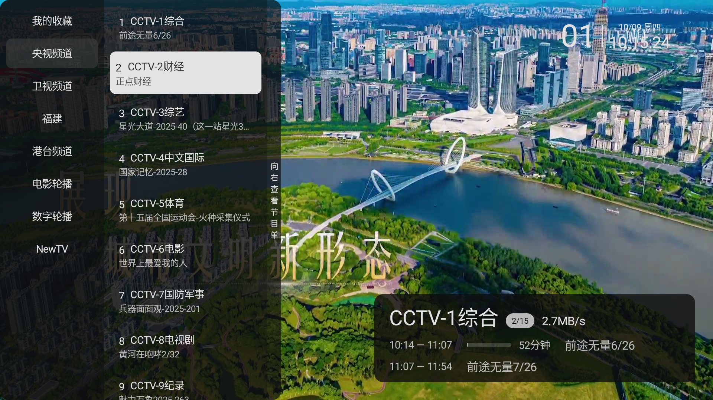
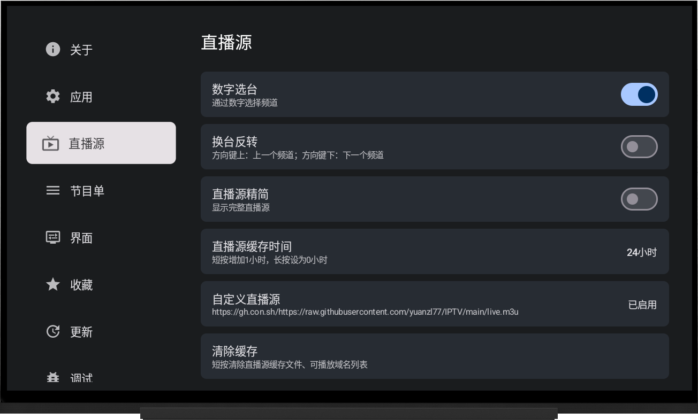

    <h1>我的電視</h1>

    
使用Android原生開發的電視直播軟件

    
本分支為香港電視頻道取向的繁體中文版本，預設使用香港台精選 M3U 直播源，保留原版 UI 與操作方式。

 

## 使用

### 操作方式

> 遙控器操作方式與主流電視直播軟件類似；

- 頻道切換：使用上下方向鍵，或者數字鍵切換頻道；屏幕上下滑動；
- 頻道選擇：OK鍵；單擊屏幕；
- 設置頁面：按下菜單、幫助鍵，長按OK鍵；雙擊、長按屏幕；

### 觸摸鍵位對應

- 方向鍵：屏幕上下左右滑動
- OK鍵：點擊屏幕
- 長按OK鍵：長按屏幕
- 菜單、幫助鍵：雙擊屏幕

### 自定義設置

- 訪問以下網址：`http://<設備IP>:10481`
- 打開應用設置界面，移到最後一項
- 支持自定義直播源、自定義節目單、緩存時間等等

### 自定義直播源

- 設置入口：自定義設置網址
- 格式支持：m3u格式、tvbox格式

### 多直播源

- 設置入口：打開應用設置界面，選中`自定義直播源`項，點擊後將彈出歷史直播源列表
- 歷史直播源列表：短按可切換當前直播源（需重啓），長按將清除歷史記錄；該功能類似於`多倉`，主要用於簡化直播源切換流程
- 須知：
    1. 當直播源數據獲取成功時，會將該直播源保存到歷史直播源列表中
    2. 當直播源數據獲取失敗時，會將該直播源移出歷史直播源列表

### 多線路

- 功能描述：同一頻道擁有多個播放地址，相關標識位於頻道名稱後面
- 切換線路：左右方向鍵；屏幕左右滑動
- 自動切換：噹噹前線路播放失敗後，將自動播放下一個線路，直至最後

### 自定義節目單

- 設置入口：自定義設置網址
- 格式支持：.xml、.xml.gz格式

### 多節目單

- 設置入口：打開應用設置界面，選中`自定義節目單`項，點擊後將彈出歷史節目單列表
- 具體功能請參照`多直播源`

### 當天節目單

- 功能入口：打開應用選台界面，選中某一頻道，按下菜單、幫助鍵、雙擊屏幕，將打開當天節目單
- 須知：由於該應用不支持回放功能，所以更早的節目單沒必要展示

### 頻道收藏

- 功能入口：打開應用選台界面，選中某一頻道，長按OK鍵、長按屏幕，將收藏/取消收藏該頻道
- 切換顯示收藏列表：首先移動到頻道列表頂部，然後再次按下方向鍵上，將切換顯示收藏列表；手機長按頻道信息切換

## 下載

可以通過右側release進行下載或拉取代碼到本地進行編譯

## 説明

- 僅支持Android5及以上
- 部分直播源要求網絡環境必須支持IPV6
- 只在自家電視上測過，其他電視穩定性未知

## 功能

- [x] 換台反轉
- [x] 數字選台
- [x] 節目單
- [x] 自動更新
- [x] 多直播源
- [x] 多線路
- [x] 自定義直播源
- [x] 多節目單
- [x] 自定義節目單
- [x] 頻道收藏
- [x] 應用自定義設置
- [x] TV端適配
- [ ] 性能優化

## 發佈
- 發佈流程：
    1. 確保項目代碼已更新到最新版本
    2. 執行`release.sh`腳本，按照提示輸入新版本號
    3. 腳本將自動更新`tv/build.gradle.kts`文件中的版本號，並提交到Git倉庫
    4. 推送標籤到遠程倉庫，觸發GitHub Actions編譯APK
    5. 等待編譯完成，下載最新APK，會自動更新到GitHub 的release上，並自動觸發update json    

## 聲明

此項目（我的電視）是個人為了興趣而開發, 僅用於學習和測試。 所用API皆從官方網站收集, 不提供任何破解內容。

## 致謝

- [my-tv](https://github.com/lizongying/my-tv)
- [參考設計稿](https://github.com/lizongying/my-tv/issues/594)
- [IPV6直播源](https://github.com/zhumeng11/IPTV)
- [live](https://github.com/fanmingming/live)
- 等等
