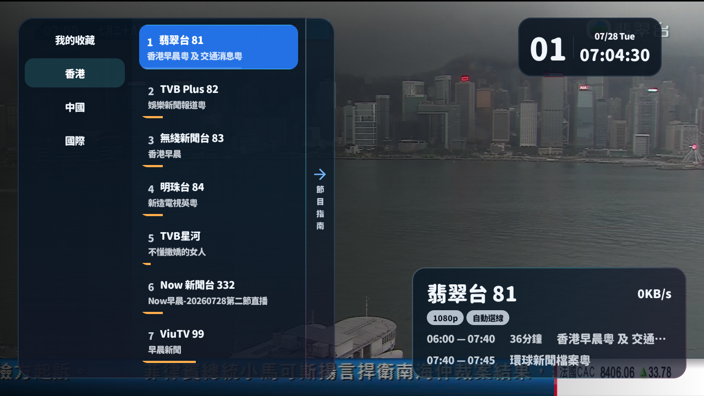
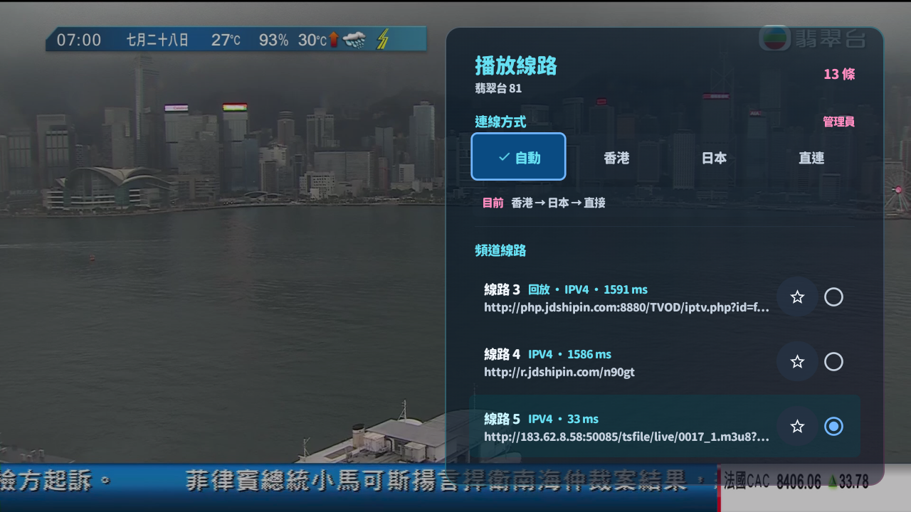

<p align="center">
  
</p>

<h1 align="center">Aulama TV</h1>

<p align="center">
  為 Android TV、Google TV 及 Android 手機而設嘅 Aulama IPTV 播放器。
</p>

<p align="center">
  <a href="https://github.com/siumiu1968/Aulama_TV/releases/tag/v2.6.19-family"></a>
  <a href="https://github.com/siumiu1968/Aulama_TV/releases"></a>
  <a href="https://apilevels.com/"></a>
  <a href="./LICENSE"></a>
</p>

> 目前正式版本：Android TV `2.6.19-family`、Android 手機 `1.1.3`；Android TV 最新測試版為 `2.6.20-beta.2`。

## 2.6.20 Beta 2 測試重點

- **按網絡自動學習**：Wi-Fi、Ethernet、流動網絡及 VPN 分開記錄每條線路／播放器嘅成功率、開台速度與穩播時間，下次優先重用當時有效嘅組合。
- **快開／穩播雙模式**：正常線路維持快速開台；同一線路及解碼模式近期真實重緩衝後，會暫時增加安全緩衝，穩播兩分鐘後自動回復快開。
- **換網唔誤傷線路**：網絡切換造成嘅舊連線中斷唔會當成來源失效；特別重連有次數上限，避免網絡抖動形成無限重試。
- **保護本機紀錄**：新健康紀錄只保存不可逆線路指紋，常見 token 更新後仍可沿用經驗，唔會新增完整簽名網址紀錄。
- **保持合理直播時效**：冇強制一至兩分鐘延遲；只採用有界緩衝，避免短 HLS 滑動視窗出現過期片段或追唔上直播。

## 2.6.20 Beta 1 測試重點

- **有限自動恢復**：硬卡死會依次嘗試相容播放器、同線重載及後備線；全部用盡後停止，避免無限黑畫重試。
- **一鍵重新嘗試**：終端錯誤會顯示遙控器可直接操作嘅重試掣，返回 App 後亦會重新取得焦點。
- **保留仍有畫面嘅播放器**：低幀率或掉幀只作軟警告，唔再拆走其實仍然出緊畫嘅引擎；真正凍畫仍會即時自救。
- **非標準 HLS 相容**：已知無 `.m3u8` 副檔名嘅直播網址會直接用 HLS 解析，減少錯誤容器探測同開台延遲。
- **杜絕舊重試競態**：停止、換線或到達失敗畫面後，舊播放器 callback／延遲任務唔會再偷偷重開。
- **較合理首幀時間**：1080p 直連等待 15 秒，底層載入逾時延後作安全網，避免兩個 watchdog 同一刻互相打斷。

## 2.6.19 更新重點

- **卡死自動恢復**：直播連續緩衝約 12 秒後會主動自救，唔再長時間停喺無聲定格畫面。
- **統一恢復次序**：依次嘗試換解碼引擎、同線重載、切換後備線，冇後備時重載原線。
- **修正 IJK 漏報**：播放器停止輸出但殘留 FPS 數據時，仍可正確判斷播放卡死。
- **修正 Media3 監察**：正常緩衝唔會再錯誤重設首幀狀態或取消載入逾時。
- **減少反覆重開**：短暫波動保持保守處理，同時重新啟動健康監察，避免永久失去自救。

## 2.6.18 更新重點

- **修復 App 內更新下載失敗**：GitHub Release 回應較慢時不會再因 10 秒讀取逾時而中止。
- **降低更新記憶體佔用**：APK 改為串流寫入儲存空間，不再一次載入整個檔案。
- **避免殘缺 APK**：下載中斷會清理未完成檔案，保留既有 SHA-256 完整性校驗。

## 2.6.17 更新重點

- **4K 開台更穩定**：翡翠台等 4K 線路會先嘗試同一來源嘅 Media3，再切換 IJK；其後才會測試其他 4K，最後先降至 1080p。
- **記住成功播放器**：同一線路經 IJK 成功播放後，下次會直接沿用 IJK，避免重複已知失敗嘅 Media3 流程。
- **減少錯誤切線**：當解碼及畫面輸出 FPS 仍然健康，唔會再只因直播時間軸短暫停頓而誤判卡死。
- **合理等待首幀**：4K 直連會等候最多 15 秒，俾高碼率直播足夠時間完成連線及解碼。
- **分開記錄線路健康度**：直接連線、香港及日本中轉各自計算表現，避免某一連線地區失敗後誤傷其他地區。
- **完整同步頻道標誌**：補齊中國及國際頻道標誌；將外站限流、失效連結及舊裝置難以載入嘅 SVG 統一改用 Aulama 同源 PNG，與網頁版保持一致。

## 新版介面

### 頻道與節目指南



頻道清單、目前／下一節節目、播放資訊及節目指南會保持同一個遙控器操作流程；節目資料按香港時間顯示。

### 智能播放線路



用遙控器即可切換自動、香港、日本或直接連線模式，亦可為個別線路設定手動優先次序。

## 功能

- **遙控器優先介面**：適配 Android TV、Google TV 及 D-pad；清晰顯示焦點、目前狀態及可操作項目。
- **節目單**：顯示目前、下一節與當日節目；支援 XMLTV／XMLTV.GZ 自訂來源。
- **智能多線路**：按畫質、連線地區、成功率、啟動速度、卡頓與近期穩定觀看表現排列候選線路；播放異常會先嘗試同一來源嘅相容播放器，再平順切換後備。
- **手動優先**：可為同一頻道排定多條優先線路；自動模式會在首選失敗後繼續後備。
- **Aulama ID**：訪客可直接使用；登入後可用 QR Code／配對碼同步收藏、自訂 M3U 及線路優先次序。
- **播放相容性**：按裝置能力選擇合適的解碼及色彩路徑，舊 Android TV 不支援 HDR 時會避開不合適線路。
- **個人化**：支援收藏、數字選台、換台反轉、自訂 M3U／TVBox 清單與自訂節目單。

## 下載

| 平台 | 版本 | 下載 |
| --- | --- | --- |
| Android TV／Google TV 測試版 | `2.6.20-beta.2` | [下載 Beta APK](https://github.com/siumiu1968/Aulama_TV/releases/download/v2.6.20-beta.2/mytv-android-tv-2.6.20-beta.2-all-sdk21.apk) |
| Android TV／Google TV | `2.6.19-family` | [下載 APK](https://github.com/siumiu1968/Aulama_TV/releases/download/v2.6.19-family/mytv-android-tv-2.6.19-family-all-sdk21.apk) |
| Android 手機 | `1.1.3` | [下載 APK](https://github.com/siumiu1968/Aulama_TV/releases/tag/android-v1.1.3) |
| 網頁版 | 最新版 | [開啟 Aulama IPTV](https://aulama.org/iptv/) |

## 基本操作

- `上／下`：切換頻道或移動焦點。
- `OK`：確認目前選項。
- `Menu／選單鍵`：開啟播放控制中心，再進入節目指南、切換線路、畫面比例或設定。
- `左／右`：在支援嘅播放畫面快速調整線路；所有設定均可由遙控器完整操作。
- `數字鍵`：直接選台。

## 自訂內容

App 支援匯入自己擁有或獲授權嘅 M3U／TVBox 直播源，以及 XMLTV／XMLTV.GZ 節目單。Aulama ID 為自選功能，未登入仍可播放及管理本機內容。

## 開發

需求：Android SDK、JDK 17、Android 5.0（API 21）或以上裝置。

```bash
./gradlew :tv:assembleRelease
./gradlew :mobile:assembleRelease
```

主要模組：

- `tv/`：Android TV／Google TV 體驗。
- `mobile/`：Android 手機體驗。
- `core/`：播放、清單、節目單及同步共用邏輯。

## 使用聲明

本項目只提供播放器與清單管理功能，不擁有、託管或保證任何第三方直播內容。請只匯入你有權使用嘅來源，並遵守所在地法律及內容供應商條款。

## 致謝

- [my-tv](https://github.com/lizongying/my-tv)
- [fanmingming/live](https://github.com/fanmingming/live)
