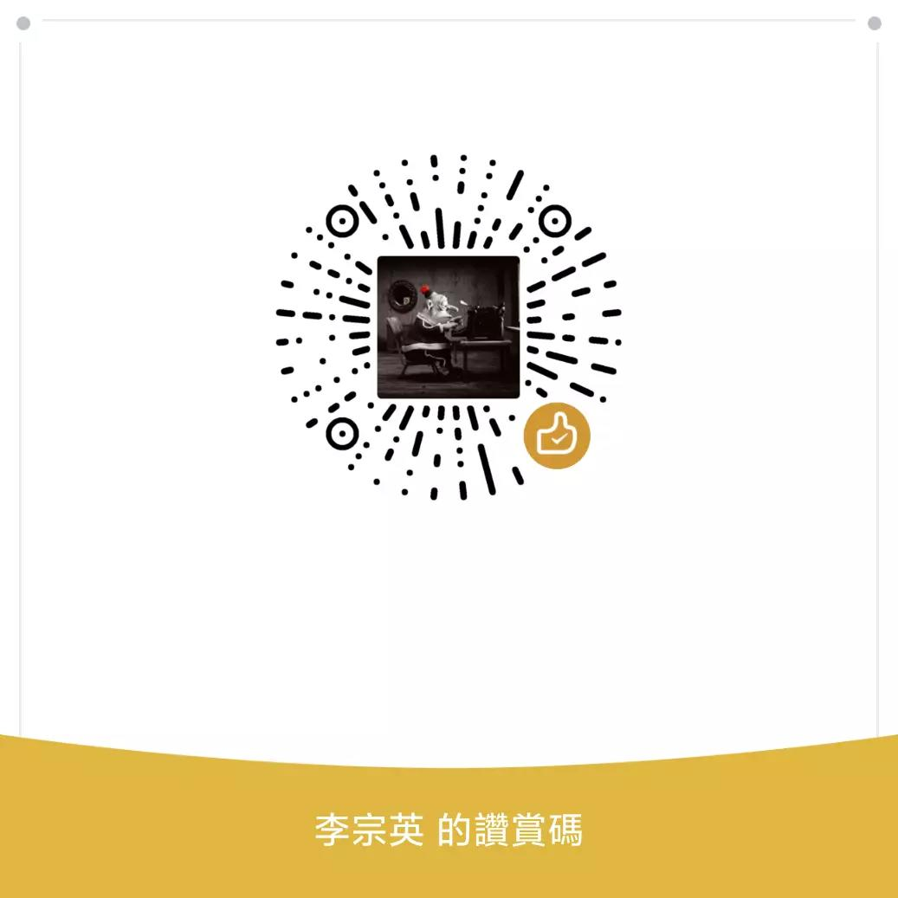

# myTV 原版修改版

這個專案是基於 `myTV` 原始碼整理的 Android TV 直播版本，主要用來保留原本介面風格，同時方便後續調整預設直播源、語言與圖示。

## 目前定位

- 保留原版 `myTV` 的操作方式與整體介面
- 適合 Android TV / 電視盒子使用
- 後續可再按需要調整預設 M3U、繁體中文介面與啟動行為

## 安裝方式

1. 下載 APK
2. 可用 U 盤安裝到電視
3. 如設備已開啟 ADB，也可以直接安裝：

```sh
adb install my-tv.apk
```

## 截圖


## 更新日誌

[更新日誌](./HISTORY.md)

## TODO

* 音量統一
* 更多港澳頻道整理
* 收藏夾
* 隱藏頻道
* 亮度調節
* 音量調節
* 自動更新

## 版权说明

[LICENSE](./LICENSE)

本專案僅供學習研究用途，請勿用於商業用途。

直播源、圖片、文字等資源如涉及版權問題，請聯絡移除。

## 赞赏


